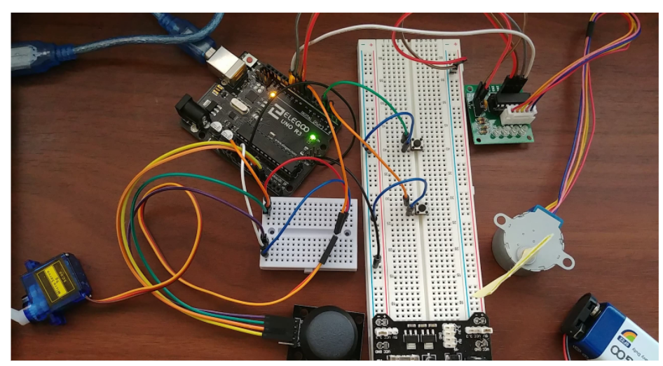

# Actuators
> This repository contains 3 tasks. Task 1 uses two push buttons to control the rotation of a servo motor. When push button 1 is pressed the servo turns 45 degrees CW. When push button 2 is pressed, the servo turns 45 degrees CCW. 
> Task 2 uses a stepper motor. The internal shaft of the stepper motor has 32 steps per revolution and the output has a gear reduction of 64; resulting in 2048 steps per revolution. Task 2 relies on 2 push buttons. Push button 1 rotates the stepper motor CW and push button 2 rotates the stepper CCW. Task 3 uses a joystick to control the rotation of the stepper motor and servo motor. When the joystick moves to the right/left the stepper turns CW and CCW. When the joystick moves forward/backward, the stepper turns CW and CCW.

## Table of contents
* [General info](#general-info)
* [Technologies](#technologies)
* [Circuit Setup](#circuit-setup)
* [Status](#status)
* [Contact](#contact)

## General info
The purpose of this project is to explore the contents in the ELEGOO UNO Starter Kit and Atmega328 uController

## Technologies
* ArduinoIDE- version 1.8.13

## Circuit Setup

## Status
Project is: _finished_

## Contact
Created by [@akansha-n888](https://www.linkedin.com/in/akansha-nagar/) - feel free to contact me!
